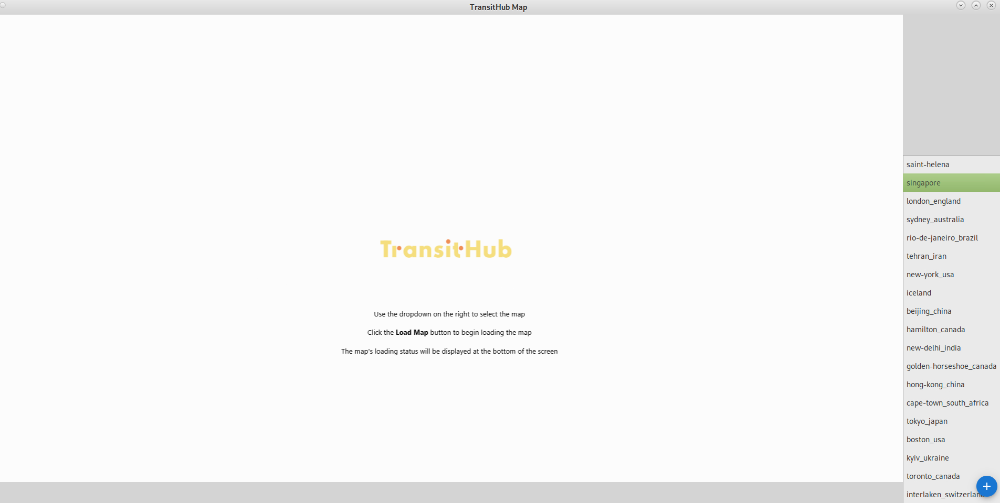
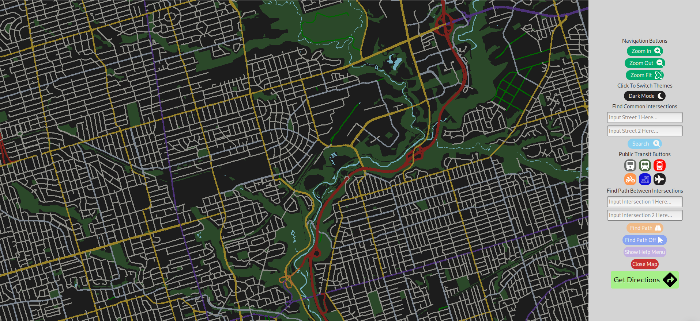
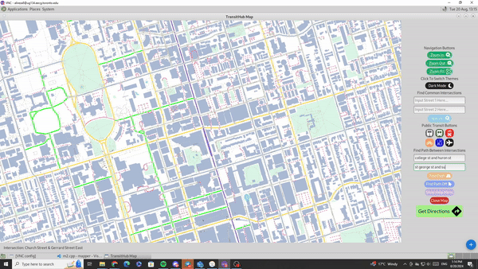
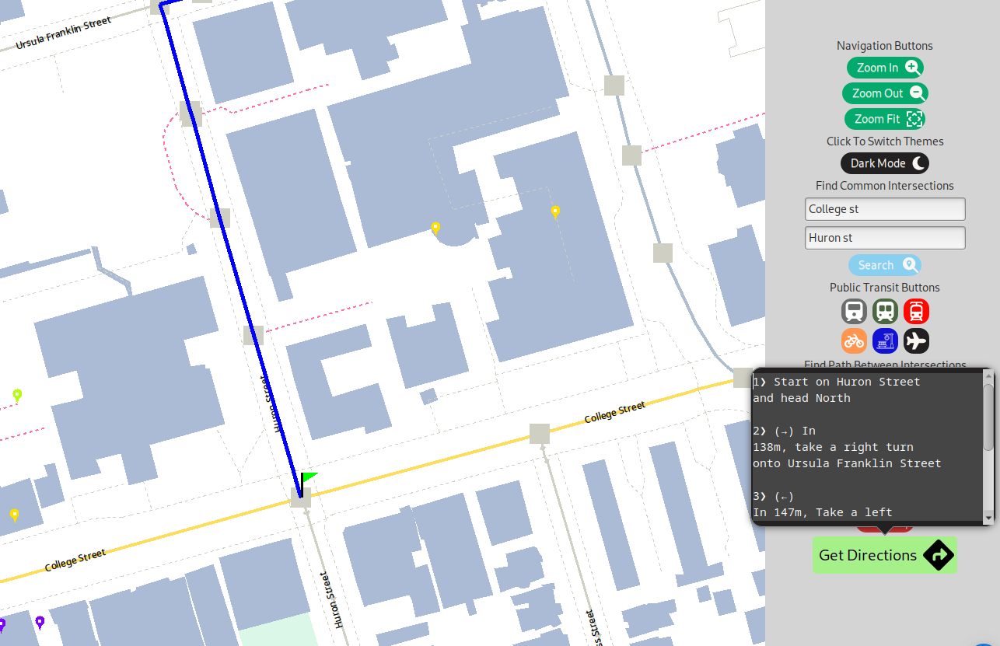
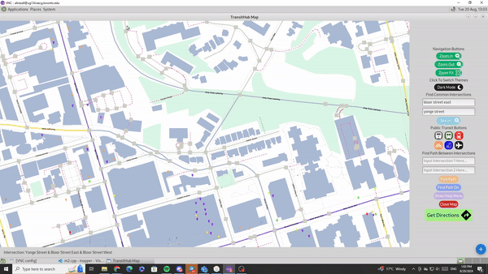
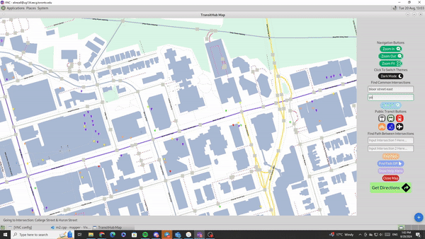
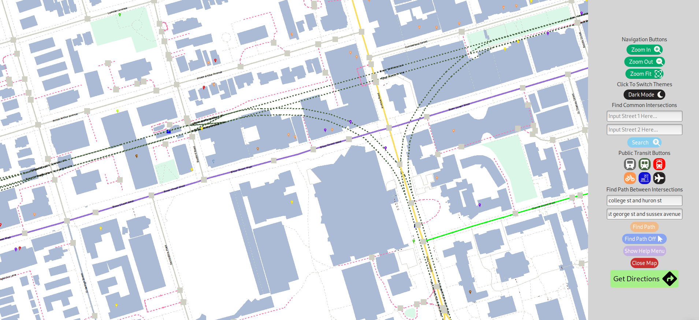
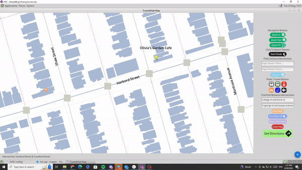

# TransitHub Overview

TransitHub is an interactive mapping application designed to enhance urban navigation. The map on the home screen provides a user-friendly interface where commuters, tourists, and city planners can seamlessly explore various transit options across the city.

## Main Features

- **Interactive Map**: The core of TransitHub is its dynamic, responsive map that allows users to navigate through the city with ease. The map displays various transit options, including trains, subways, trams, bicycle trails, public transport stations, and more, all accessible through intuitive buttons and icons.

- **Pathfinding Algorithms**: TransitHub employs advanced pathfinding algorithms to calculate the most efficient routes between points. Whether you are switching between transit modes or zooming into intersections, the app provides near-instantaneous results.

- **Customizable Viewing Experience**: Users can switch between light and dark themes with a simple toggle, ensuring optimal visibility in different environments.

- **Dynamic Points of Interest (POIs)**: Explore the city with our categorized POIs, which include restaurants, libraries, police stations, and more. Each category is color-coded for easy identification, and detailed information is available at a click.
## Algorithms

### Pathfinding Algorithms
TransitHub employs advanced pathfinding algorithms to ensure that users can quickly and efficiently find the best routes between points on the map.

#### Dijkstra's Algorithm
In our initial approach, we utilized **Dijkstra's Algorithm**, a well-known algorithm for finding the shortest path in graphs where each edge has a weight, representing the travel time between intersections. Dijkstra’s algorithm prioritizes nodes with the lowest cumulative cost, ensuring optimal pathfinding for every journey. This makes it ideal for navigating complex urban environments with varying travel times.

#### Optimized Pathfinding with Precomputed Data
To enhance performance, we optimized our implementation by precomputing and storing all possible distances between nodes in a global dataset. This precomputed data is loaded when the map initializes, allowing the algorithm to rapidly identify the optimal route in real-time, reducing pathfinding time to under a second. This ensures that even in the most complex urban scenarios, TransitHub delivers quick and accurate routing results.

### Visual Enhancements in Pathfinding
TransitHub goes beyond traditional pathfinding by incorporating dynamic visual elements. When users select their start and end points, the algorithm not only computes the best path but also provides visual cues such as a green flag for the starting point and a red flag for the endpoint. Additionally, our dynamic zoom feature smoothly transitions the view from the current location to the selected intersection, enhancing user understanding and interaction with the map.

### Handling Complex Routing Problems

#### Traveling Salesman Problem (TSP)
In tackling more complex routing challenges, such as the **Traveling Salesman Problem (TSP)**, TransitHub introduces a combination of algorithms and techniques to find near-optimal solutions in a reasonable timeframe.

##### Greedy Algorithm
Initially, a **Greedy Algorithm** was implemented, where the system always travels to the next closest intersection. While this provided a baseline solution, further improvements were necessary to handle more complex scenarios.

##### MultiDijkstra’s Algorithm
To build on this, we integrated **MultiDijkstra's Algorithm**, allowing the system to explore multiple routes simultaneously, significantly improving the efficiency of our pathfinding capabilities. This approach is particularly useful in scenarios requiring the simultaneous evaluation of multiple potential routes, as it reduces computation time and enhances overall performance.

##### Smart Calculator
An innovative addition is the **Smart Calculator**, which simulates thousands of route scenarios by selecting random starting points and iterating continuously to identify the most time-efficient path. This tool has proven essential in refining our pathfinding algorithms, enabling TransitHub to achieve near-optimal solutions even in the most complex routing problems.

##### Multithreading
To further enhance performance, we implemented **Multithreading**. This allows TransitHub to utilize multiple processor cores simultaneously, speeding up the computation process and ensuring the application remains responsive under heavy loads. This capability is especially critical when handling complex calculations and ensures that TransitHub delivers quick and reliable results, even in demanding scenarios.

## Screenshots

### Dark Mode

### Pathfinding By Search

### Directions

### Pathfinding By Clicking

### Dynamic Zoom Feature

### Transit Lines

### Clicking Points of Interests (POTs)

